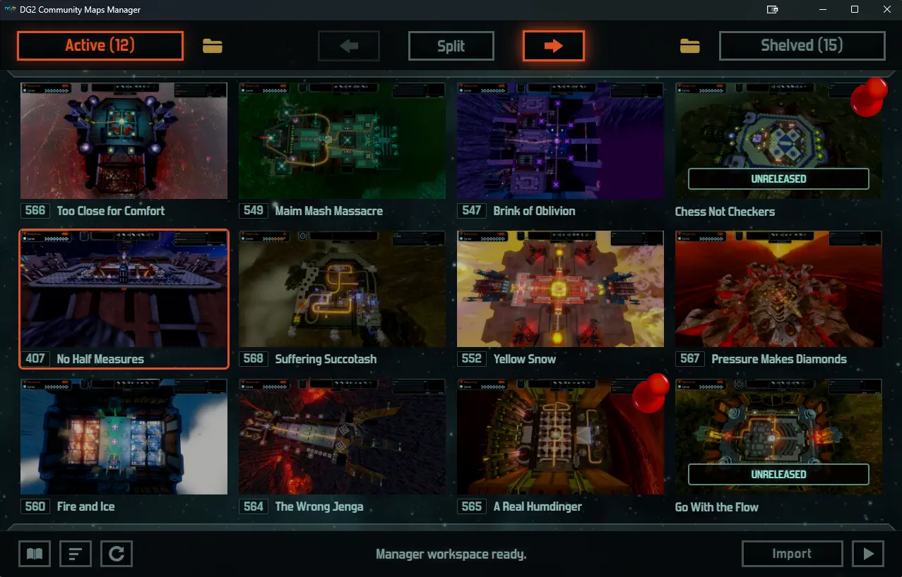

# DG2 Community Maps Manager

Windows preview app for managing Defense Grid 2 community maps.

[Download latest release](https://github.com/dg2-community/dg2-maps-manager/releases/latest/download/DG2-Community-Maps-Manager.zip)

## Why this app exists

Defense Grid 2 custom maps are still worth playing, but installing and managing them by hand can be awkward.

DG2 Community Maps Manager exists to:

- Import DG2 map ZIPs safely. Windows can create an extra folder level when extracting ZIP files, but Defense Grid 2 expects the playable map folder to sit directly inside `Documents\DG2`. The manager handles that structure for ZIPs from [dg2freemaps.com](https://www.dg2freemaps.com/category/forever-free-maps/), either through the Import button or drag and drop.

- Keep the active map folder under control. Having too many custom maps active in `Documents\DG2` can make the game unstable on some systems. The manager helps you keep a larger library while moving only the maps you currently want to play into the active DG2 folder.

- Bring map previews back into the workflow. Since custom-map thumbnails are no longer available in-game, the manager shows catalog previews before launch so map names are easier to recognize.

- Keep map management local and simple. The app manages your local library and the active DG2 folder without requiring an installer, account, or separate launcher service.

## Use

1. Download the ZIP.
2. Extract the full folder.
3. Start `DG2 Community Maps Manager.exe`.

## Notes

- Unsigned Windows ZIP, no installer.
